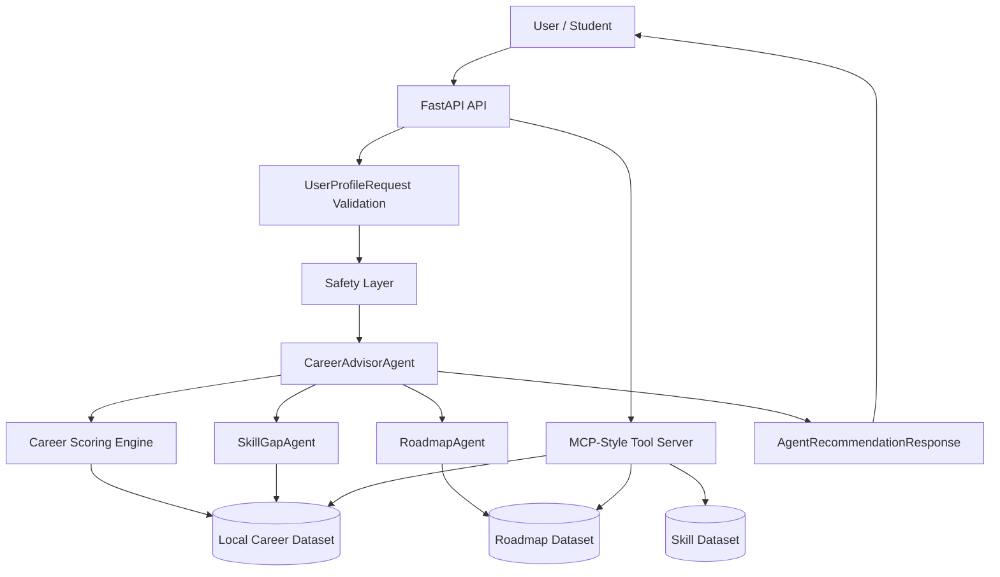

# CareerVerse Agent — AI Career Guidance Agent for Students

## Track
Track: Agents for Good

---

## Problem
Students and early-career learners often do not know which tech career path fits them. Generic career advice is typically static, high-level, and not personalized to a learner's concrete interests, skills, or timelines. To transition successfully, learners need personalized career recommendations, detailed skill gap analysis, and structured day-by-day learning roadmaps.

---

## Solution
CareerVerse Agent is a focused backend MVP designed for the Kaggle Capstone. It utilizes:
- An asynchronous **FastAPI backend** exposing REST and MCP-style routes.
- A **local production-minded career dataset** comprising 80 careers, 260 skills, and 80 roadmaps.
- A **deterministic scoring engine** ranking alignment with student interest, skill, and goal fields.
- A **multi-agent workflow** splitting orchestration, readiness evaluation, and roadmap synthesis.
- A **safety layer** validating inputs against instruction overrides and prompt injection attacks.
- An **offline evaluation pipeline** asserting aggregate recommendation quality and compliance.

---

## Why Agents?
The career guidance process involves multiple analytical steps that are best separated to ensure scalability and maintainability:
- **Orchestration**: The `CareerAdvisorAgent` manages the request lifecycle, ensuring safety checks pass before invoking sub-agents.
- **Readiness Analysis**: The `SkillGapAgent` focuses on comparing user skill sets to career prerequisites, deriving percentages and missing competencies.
- **Plan Synthesis**: The `RoadmapAgent` resolves detailed learning tracks to construct study roadmaps.
- **Resource Integration**: MCP-style tools expose local data resources asynchronously to the agents.

---

## Key Course Concepts Demonstrated
- **Multi-agent system**: Sequential execution separating coordinator and worker responsibilities.
- **MCP-style tool integration**: Local tool schema endpoints exposing career database catalogs.
- **Agent Skills**: Clear definition of behavioral constraints and output schemas in `SKILL.md` documents.
- **Security and Responsible AI**: Runtime prompt-injection filters, text redaction, and strict disclaimers.
- **Local evaluation pipeline**: Aggregate regression verification of 14 key test profiles.
- **FastAPI deployability**: Asynchronous routes designed to be packaged and run in cloud containers.

> [!NOTE]
> This MVP uses local JSON datasets and a custom mock tool interface. It does not use the official Model Context Protocol python SDK or connect to external LLMs.

---

## Architecture
The system component context is represented by the following flow:



---

## Features

### Implemented Features (MVP)
- **Web UI Dashboard**: Interactive React + TypeScript + Vite frontend client.
- **Observability Layer**: Structured JSON-like logging, `X-Request-ID` request tracking middleware, liveness (`/health/live`), readiness (`/health/ready`) endpoints.
- **Feedback & Metrics API**: Solicitation, sanitization, safety filtering, and metrics dashboard APIs.
- **Career Recommendation**: Ranks matching careers with breakdowns for interest, skill, and goal similarities.
- **Skill Gap Analysis**: Compares user skills to required profiles, calculating readiness scores.
- **Personalized Roadmap**: Provides a 30-day daily task list and an 8-week structured project curriculum.
- **Multi-Agent Workflow**: Separates parsing, checking, scoring, and plan gathering across agents.
- **MCP-Style Tool Server**: Exposes career catalogs as local resource endpoints.
- **Agent Skill Documentation**: Reusable behavioral files mapping compliance guidelines.
- **Prompt Injection Safety**: Filters input payloads for override attempts.
- **Local Evaluation Pipeline**: Runs regression tests locally with no keys.
- **FastAPI Demo API**: REST endpoint suite with interactive OpenAPI documentation.

### Future Work
- **Real Gemini Explanation Layer**: Integration of Google GenAI SDK to generate personalized fit summaries.
- **Real MCP SDK Integration**: Wrapping endpoints with the official Model Context Protocol library.
- **Vector Retrieval**: Performing semantic searches using pgvector and embeddings.
- **CV Parser**: Parsing PDF/Word resumes into Pydantic models.
- **Market Trend Data**: Scraping live job ads to enrich demand forecasts.
- **Mentor Matching**: Recommending mentors based on target career paths.
- **Production User Accounts & Auth**: Full authentication, login system, and multi-user persistent states.
- **Enterprise Analytics Warehouse**: High-scale data warehouses for long-term analytics logs.
- **Cloud Deployment**: Containerized hosting on GCP/AWS.

---

## Tech Stack
- **Python 3.11+**
- **FastAPI**
- **Pydantic v2**
- **pytest**
- **ruff**
- **local JSON datasets**

---

## Project Structure
```text
Careerverse-agent-capstone/
├── app/
│   ├── agents/          # Multi-agent orchestrators and workers
│   ├── core/            # System configuration and scoring logic
│   ├── data/            # Local JSON career and skill datasets
│   ├── evals/           # Local evaluation script and test cases
│   ├── mcp_server/      # MCP-style tool endpoints
│   ├── schemas/         # Pydantic validation schemas
│   ├── skills/          # Reusable agent skill definitions (SKILL.md)
│   ├── tools/           # File loading and safety functions
│   └── main.py          # FastAPI application entrypoint
├── docs/                # Design, architecture, and Kaggle writeup documents
├── scripts/             # Setup, dataset, and compliance check scripts
└── tests/               # Pytest suite running 180 unit checks
```

---

## Setup

1. **Create and Activate Virtual Environment**:
   ```bash
   python -m venv .venv
   .venv\Scripts\activate
   ```
   *(For macOS/Linux: `source .venv/bin/activate`)*

2. **Install Dependencies**:
   ```bash
   pip install -r requirements.txt
   ```

---

## Run the API

1. **Start the Local Development Server**:
   ```bash
   uvicorn app.main:app --reload
   ```

2. **Inspect Swagger Interactive Docs**:
   Navigate to the Swagger UI page at:
   ```text
   http://127.0.0.1:8000/docs
   ```

---

## Docker Runtime

Build the image:

```bash
docker build -t careerverse-agent-api .
```

Run the container:

```bash
docker run --rm -p 8000:8000 careerverse-agent-api
```

Run with Docker Compose:

```bash
docker compose up --build
```

Run Docker smoke check:

```bash
python scripts/docker_smoke_check.py
```

The default Docker runtime does not require external API keys. Do not commit `.env` files or real secrets.

---

## API Versioning
New clients should use versioned `/api/v1/...` endpoints. Legacy endpoints remain fully active and supported for backward compatibility during the MVP stage. For a detailed breakdown of the API layout, versioning policy, and standard error contract, refer to [api_versioning.md](file:///e:/OneDrive/Desktop/careerverse-agent-capstone/Careerverse-agent-capstone/docs/api_versioning.md).

## API Usage
The following endpoints are exposed on the FastAPI instance:

### Versioned Endpoints (v1)
- `GET /api/v1/health` - Versioned service health check.
- `GET /api/v1/metadata` - Versioned app metadata and capstone track info.
- `POST /api/v1/profiles/validate` - Validates and normalizes user profile payloads.
- `POST /api/v1/recommend` - Evaluates match scoring and runs versioned multi-agent workflow.
- `GET /api/v1/tools` - Lists local MCP-style tools under v1.
- `GET /api/v1/mcp/careers` - Lists all careers.
- `GET /api/v1/mcp/skills` - Lists skill categories and items.
- `GET /api/v1/mcp/search/careers?q=AI` - Search careers by keyword under v1.
- `GET /api/v1/mcp/search/skills?q=Python` - Search skills by keyword under v1.
- `POST /api/v1/safety/validate-profile` - Validates profile safety constraints.

### Legacy Endpoints (Backward Compatibility)
- `GET /` - Root status check.
- `GET /metadata` - App version and track info.
- `POST /profiles/validate` - Legacy profile validation.
- `POST /recommend` - Legacy recommendation scoring.
- `GET /tools` - Legacy MCP tool listing.
- `GET /mcp/careers` - Legacy listing of careers.
- `GET /mcp/search/careers?q=AI` - Legacy keyword career search.
- `GET /mcp/search/skills?q=Python` - Legacy keyword skill search.

---

## Example Request
Students submit their profiles as JSON to `POST /recommend`:
```json
{
  "name": "Demo User",
  "education": "Final-year IT student",
  "interests": ["AI", "web development", "product building"],
  "skills": ["Python", "React", "SQL"],
  "career_goal": "Become an AI full-stack developer",
  "preferred_learning_style": "project_based",
  "language": "en",
  "experience_level": "university",
  "time_budget_hours_per_week": 8
}
```

---

## Example Response
```json
{
  "user_summary": {
    "name": "Demo User",
    "experience_level": "university",
    "skills_count": 3
  },
  "top_recommendations": [
    {
      "career_id": "ai_fullstack_developer",
      "title": "AI Full-Stack Developer",
      "score": 0.85,
      "breakdown": {
        "interest_match": 0.9,
        "skill_match": 0.8,
        "goal_match": 0.9
      },
      "matched_skills": ["Python", "React"],
      "missing_skills": ["TypeScript", "PyTorch", "Docker"],
      "fit_explanation": "Strong interest match with AI and Web Dev, and you already know Python and React."
    }
  ],
  "skill_gap": {
    "career_id": "ai_fullstack_developer",
    "missing_skills": ["TypeScript", "PyTorch", "Docker"],
    "readiness_percentage": 40.0
  },
  "personalized_roadmap": {
    "career_id": "ai_fullstack_developer",
    "duration_days": 30,
    "weekly_tasks": [
      {
        "week": 1,
        "topic": "TypeScript & Frontend API Integration",
        "description": "Learn TypeScript fundamentals and integrate them into React projects."
      }
    ]
  },
  "safety_notice": "This system provides educational career guidance only. It does not guarantee employment outcomes or replace professional counseling.",
  "course_concepts_demonstrated": [
    "Multi-agent system",
    "MCP-style tool integration",
    "Agent Skills",
    "Security and Responsible AI",
    "Local evaluation pipeline"
  ]
}
```

---

## Input Validation
Input validation constraints are implemented inside `app/schemas/profile_schema.py` using Pydantic v2. This validates and normalizes student profiles before any scoring is carried out.

---

## Career Scoring Engine
The deterministic career matching score is calculated via the scoring engine based on interest matching, skill matching, and career goal keyword checks.

---

## Multi-Agent Workflow
The recommendation pipeline splits tasks sequentially among specialized agents, coordinated by the `CareerAdvisorAgent`.

---

## Data Access and Persistence Readiness
The MVP uses local JSON repositories by default. Repository interfaces prepare the codebase for future PostgreSQL or other storage backends, but no production database is required for local tests.

---

## Optional Explanation Service
The explanation service works offline by default. LLM-based explanations are optional and disabled unless explicitly enabled by environment configuration.

---

## Saved Recommendations
The project includes a demo-safe saved recommendation foundation. It does not implement full authentication or password-based user accounts. Saved recommendation storage is designed to avoid sensitive personal data.

---

## Web UI
The repository includes a React + TypeScript web app under `web/` to interact with the career advisor agent.
To run the dashboard locally:
```bash
cd web
npm install
npm run dev
```
By default, the client directs API queries to the local backend. Adjust the API target endpoint through the following Vite environment variable:
```env
VITE_API_BASE_URL=http://127.0.0.1:8000
```
The web dashboard lets users submit a career profile, view recommendations, inspect skill gaps, preview roadmaps, and submit safe feedback. It does not implement production authentication or registration flows.

---

## Observability
The backend includes structured console/file logging and custom request tracing middleware:
- **Request Tracking**: Every request is assigned a unique tracking code via `X-Request-ID` returned in header responses.
- **Safe Structured Logging**: Logs trace method paths and latencies without writing raw request bodies or private user configurations.
- **Health Checks**: Checks application liveness at `/api/v1/health/live` and dataset/system readiness at `/api/v1/health/ready`.
- **Metrics Summary**: Exposes aggregated scores and LLM status codes.

---

## Feedback Analytics
The feedback system solicits and stores anonymous recommendation ratings and comments locally:
- **Redaction Filters**: Comments containing email strings or input override prompts are sanitized and redacted.
- **Aggregated Summaries**: Basic ratings are grouped into summaries without storing raw user profiles.
- **Ephemeral Store**: All records are held inside an InMemory repository. It is a local demo feedback storage, not a production analytics warehouse.

---

## CI/CD

This repository includes GitHub Actions workflows for backend validation, frontend build, documentation consistency, evaluation, and security hygiene.

---

## Deployment Preparation

Deployment documentation is available in `docs/deployment.md`. The primary documented target is Google Cloud Run. The repository does not claim a live deployment unless a deployment has been explicitly verified.

---

## Production Readiness and Launch Pack

Launch materials are available under `docs/launch/`, including the product one-pager, onboarding guide, FAQ, known limitations, privacy note, and responsible AI note.

---

## FR/NFR Verification

The repository includes a full functional and non-functional requirements verification suite.

To verify requirements, run:
```bash
python scripts/verify_all_fr_nfr.py
```

To run the full project quality gate:
```bash
python scripts/verify_full_project.py
```

The FR/NFR verification includes:
- At least 50 test cases per functional requirement.
- At least 50 test cases per non-functional requirement.
- Traceability matrix mapping.
- Security and privacy regression checks.
- API and web regression checks.
- Documentation consistency checks.

---

## Local Evaluation
To execute the aggregate offline validation suite, run:
```bash
python -m app.evals.evaluate_agent
```
This script tests 14 scenarios covering normal, edge-case, security injection, and invalid schema inputs. It calculates a performance grade, and returns a non-zero exit code if any case fails.

---

## Testing
To run the full validation and test harness:
```bash
python scripts/validate_domain_dataset.py
python scripts/audit_prompt_0_to_7.py
python scripts/smoke_test_api.py
python -m app.evals.evaluate_agent
python scripts/check_documentation_consistency.py
python -m compileall app
ruff check .
pytest
```

---

## Development
To check typing, compliance constraints, and tests locally, run compile, lint, and pytest validations.

---

## Security and Responsible AI
The system adopts defensive security validation to protect public demonstrations:
- **Prompt Injection Detection**: Inputs matching override instructions are flagged, returning an HTTP 400 Bad Request error.
- **Credential Scrubber**: Redacts occurrences of passwords, access tokens, or credentials within inputs.
- **Educational Disclaimer**: Every response includes the following mandatory statement:
  > This system provides educational career guidance only. It does not guarantee employment outcomes or replace professional counseling.
- **Clinical/Mental Disclaimer**: The system does not attempt clinical evaluation, psychological counseling, or employment guarantees.

---

## Dataset
Based on local high-fidelity JSON files parsed during initialization:
- **Careers**: 80 standard profiles.
- **Skills**: 260 skill profiles and related tags.
- **Roadmaps**: 80 structured timelines.

You can verify dataset health via:
```bash
python scripts/validate_domain_dataset.py
```

---

## Domain Data
High-fidelity local templates representing 80 careers, 260 skills, and 80 roadmaps are stored in the `app/data/` folder.

---

## Agent Skills
Our agents are governed by strict skill manifests detailing their input requirements, logic, output structures, and error limits:
- [career_advisor/SKILL.md](file:///E:/OneDrive/Desktop/careerverse-agent-capstone/Careerverse-agent-capstone/app/skills/career_advisor/SKILL.md) - Recommendations, Orchestration, Tool invocation.
- [code_quality/SKILL.md](file:///E:/OneDrive/Desktop/careerverse-agent-capstone/Careerverse-agent-capstone/app/skills/code_quality/SKILL.md) - Coding style, Linting, Testing directives.
- [security_review/SKILL.md](file:///E:/OneDrive/Desktop/careerverse-agent-capstone/Careerverse-agent-capstone/app/skills/security_review/SKILL.md) - Zero-trust filters, prompt injections, and redactions.
- [kaggle_submission/SKILL.md](file:///E:/OneDrive/Desktop/careerverse-agent-capstone/Careerverse-agent-capstone/app/skills/kaggle_submission/SKILL.md) - Guidelines for project presentation and packaging.

---

## MCP-Style Tool Server
Exposes data loaders (`app/mcp_server/`) allowing agent clients to discover resource configurations (`/tools`) and query items. It mimics the Model Context Protocol interface.

---

## Limitations
- **Deterministic Matcher**: Does not perform real LLM text generation or complex reasoning.
- **Static Template Catalog**: Roadmaps and matches are loaded from curated local JSON files.
- **No Dynamic Crawler**: Cannot fetch live job ads.
- **No Active DB**: Does not support persistent storage.
- **No Native Auth**: Relies on input validation instead of OAuth2.

---

## Future Work
See the **Features - Future Work** section above for planned expansions, including cloud hosting, vector search, and Gemini integration.

---

## Kaggle Submission Notes
Check the complete [submission_checklist.md](file:///E:/OneDrive/Desktop/careerverse-agent-capstone/Careerverse-agent-capstone/docs/submission_checklist.md) before final registration.

---

## License / Usage Note
Distributed under the MIT License. Built solely for the Kaggle Capstone Competitions (Agents for Good Track).
