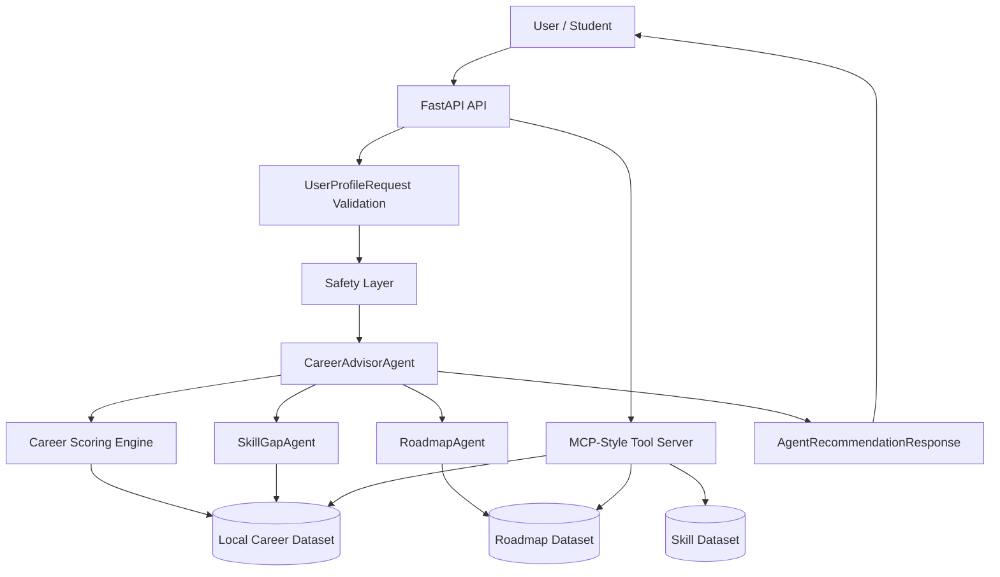

# CareerVerse Agent — AI Career Guidance Agent for Students

## Track
Track: Agents for Good

---

## Problem
Students and early-career learners often do not know which tech career path fits them. Generic career advice is typically static, high-level, and not personalized to a learner's concrete interests, skills, or timelines. To transition successfully, learners need personalized career recommendations, detailed skill gap analysis, and structured day-by-day learning roadmaps.

---

## Solution
CareerVerse Agent is a focused backend MVP designed for the Kaggle Capstone. It utilizes:
- An asynchronous **FastAPI backend** exposing REST and MCP-style routes.
- A **local production-minded career dataset** comprising 80 careers, 260 skills, and 80 roadmaps.
- A **deterministic scoring engine** ranking alignment with student interest, skill, and goal fields.
- A **multi-agent workflow** splitting orchestration, readiness evaluation, and roadmap synthesis.
- A **safety layer** validating inputs against instruction overrides and prompt injection attacks.
- An **offline evaluation pipeline** asserting aggregate recommendation quality and compliance.

---

## Why Agents?
The career guidance process involves multiple analytical steps that are best separated to ensure scalability and maintainability:
- **Orchestration**: The `CareerAdvisorAgent` manages the request lifecycle, ensuring safety checks pass before invoking sub-agents.
- **Readiness Analysis**: The `SkillGapAgent` focuses on comparing user skill sets to career prerequisites, deriving percentages and missing competencies.
- **Plan Synthesis**: The `RoadmapAgent` resolves detailed learning tracks to construct study roadmaps.
- **Resource Integration**: MCP-style tools expose local data resources asynchronously to the agents.

---

## Key Course Concepts Demonstrated
- **Multi-agent system**: Sequential execution separating coordinator and worker responsibilities.
- **MCP-style tool integration**: Local tool schema endpoints exposing career database catalogs.
- **Agent Skills**: Clear definition of behavioral constraints and output schemas in `SKILL.md` documents.
- **Security and Responsible AI**: Runtime prompt-injection filters, text redaction, and strict disclaimers.
- **Local evaluation pipeline**: Aggregate regression verification of 14 key test profiles.
- **FastAPI deployability**: Asynchronous routes designed to be packaged and run in cloud containers.

> [!NOTE]
> This MVP uses local JSON datasets and a custom mock tool interface. It does not use the official Model Context Protocol python SDK or connect to external LLMs.

---

## Architecture
The system component context is represented by the following flow:



---

## Features

### Implemented Features (MVP)
- **Career Recommendation**: Ranks matching careers with breakdowns for interest, skill, and goal similarities.
- **Skill Gap Analysis**: Compares user skills to required profiles, calculating readiness scores.
- **Personalized Roadmap**: Provides a 30-day daily task list and an 8-week structured project curriculum.
- **Multi-Agent Workflow**: Separates parsing, checking, scoring, and plan gathering across agents.
- **MCP-Style Tool Server**: Exposes career catalogs as local resource endpoints.
- **Agent Skill Documentation**: Reusable behavioral files mapping compliance guidelines.
- **Prompt Injection Safety**: Filters input payloads for override attempts.
- **Local Evaluation Pipeline**: Runs regression tests locally with no keys.
- **FastAPI Demo API**: REST endpoint suite with interactive OpenAPI documentation.

### Future Work
- **Real Gemini Explanation Layer**: Integration of Google GenAI SDK to generate personalized fit summaries.
- **Real MCP SDK Integration**: Wrapping endpoints with the official Model Context Protocol library.
- **Vector Retrieval**: Performing semantic searches using pgvector and embeddings.
- **CV Parser**: Parsing PDF/Word resumes into Pydantic models.
- **Market Trend Data**: Scraping live job ads to enrich demand forecasts.
- **Mentor Matching**: Recommending mentors based on target career paths.
- **Frontend UI**: Visual dashboard for student progress tracking.
- **Cloud Deployment**: Containerized hosting on GCP/AWS.

---

## Tech Stack
- **Python 3.11+**
- **FastAPI**
- **Pydantic v2**
- **pytest**
- **ruff**
- **local JSON datasets**

---

## Project Structure
```text
Careerverse-agent-capstone/
├── app/
│   ├── agents/          # Multi-agent orchestrators and workers
│   ├── core/            # System configuration and scoring logic
│   ├── data/            # Local JSON career and skill datasets
│   ├── evals/           # Local evaluation script and test cases
│   ├── mcp_server/      # MCP-style tool endpoints
│   ├── schemas/         # Pydantic validation schemas
│   ├── skills/          # Reusable agent skill definitions (SKILL.md)
│   ├── tools/           # File loading and safety functions
│   └── main.py          # FastAPI application entrypoint
├── docs/                # Design, architecture, and Kaggle writeup documents
├── scripts/             # Setup, dataset, and compliance check scripts
└── tests/               # Pytest suite running 180 unit checks
```

---

## Setup

1. **Create and Activate Virtual Environment**:
   ```bash
   python -m venv .venv
   .venv\Scripts\activate
   ```
   *(For macOS/Linux: `source .venv/bin/activate`)*

2. **Install Dependencies**:
   ```bash
   pip install -r requirements.txt
   ```

---

## Run the API

1. **Start the Local Development Server**:
   ```bash
   uvicorn app.main:app --reload
   ```

2. **Inspect Swagger Interactive Docs**:
   Navigate to the Swagger UI page at:
   ```text
   http://127.0.0.1:8000/docs
   ```

---

## API Usage
The following endpoints are exposed on the FastAPI instance:
- `GET /` - Root status check.
- `GET /metadata` - App version, track, and capability tags.
- `POST /profiles/validate` - Enforces type safety, normalizes arrays, and checks safety filters.
- `POST /recommend` - Evaluates match scoring and runs multi-agent workflow.
- `GET /tools` - Lists local MCP-style tools.
- `GET /mcp/careers` - Lists all careers.
- `GET /mcp/careers/{career_id}` - Gets details of a career.
- `GET /mcp/careers/{career_id}/skills` - Gets required skills for a career.
- `GET /mcp/careers/{career_id}/roadmap` - Gets roadmap template for a career.
- `GET /mcp/skills` - Lists skill categories and items.
- `GET /mcp/skills/{skill_name}` - Gets details of a specific skill.
- `GET /mcp/search/careers?q=AI` - Search careers by keyword.
- `GET /mcp/search/skills?q=Python` - Search skills by keyword.

---

## Example Request
Students submit their profiles as JSON to `POST /recommend`:
```json
{
  "name": "Demo User",
  "education": "Final-year IT student",
  "interests": ["AI", "web development", "product building"],
  "skills": ["Python", "React", "SQL"],
  "career_goal": "Become an AI full-stack developer",
  "preferred_learning_style": "project_based",
  "language": "en",
  "experience_level": "university",
  "time_budget_hours_per_week": 8
}
```

---

## Example Response
```json
{
  "user_summary": {
    "name": "Demo User",
    "experience_level": "university",
    "skills_count": 3
  },
  "top_recommendations": [
    {
      "career_id": "ai_fullstack_developer",
      "title": "AI Full-Stack Developer",
      "score": 0.85,
      "breakdown": {
        "interest_match": 0.9,
        "skill_match": 0.8,
        "goal_match": 0.9
      },
      "matched_skills": ["Python", "React"],
      "missing_skills": ["TypeScript", "PyTorch", "Docker"],
      "fit_explanation": "Strong interest match with AI and Web Dev, and you already know Python and React."
    }
  ],
  "skill_gap": {
    "career_id": "ai_fullstack_developer",
    "missing_skills": ["TypeScript", "PyTorch", "Docker"],
    "readiness_percentage": 40.0
  },
  "personalized_roadmap": {
    "career_id": "ai_fullstack_developer",
    "duration_days": 30,
    "weekly_tasks": [
      {
        "week": 1,
        "topic": "TypeScript & Frontend API Integration",
        "description": "Learn TypeScript fundamentals and integrate them into React projects."
      }
    ]
  },
  "safety_notice": "This system provides educational career guidance only. It does not guarantee employment outcomes or replace professional counseling.",
  "course_concepts_demonstrated": [
    "Multi-agent system",
    "MCP-style tool integration",
    "Agent Skills",
    "Security and Responsible AI",
    "Local evaluation pipeline"
  ]
}
```

---

## Input Validation
Input validation constraints are implemented inside `app/schemas/profile_schema.py` using Pydantic v2. This validates and normalizes student profiles before any scoring is carried out.

---

## Career Scoring Engine
The deterministic career matching score is calculated via the scoring engine based on interest matching, skill matching, and career goal keyword checks.

---

## Multi-Agent Workflow
The recommendation pipeline splits tasks sequentially among specialized agents, coordinated by the `CareerAdvisorAgent`.

---

## Local Evaluation
To execute the aggregate offline validation suite, run:
```bash
python -m app.evals.evaluate_agent
```
This script tests 14 scenarios covering normal, edge-case, security injection, and invalid schema inputs. It calculates a performance grade, and returns a non-zero exit code if any case fails.

---

## Testing
To run the full validation and test harness:
```bash
python scripts/validate_domain_dataset.py
python scripts/audit_prompt_0_to_7.py
python scripts/smoke_test_api.py
python -m app.evals.evaluate_agent
python scripts/check_documentation_consistency.py
python -m compileall app
ruff check .
pytest
```

---

## Development
To check typing, compliance constraints, and tests locally, run compile, lint, and pytest validations.

---

## Security and Responsible AI
The system adopts defensive security validation to protect public demonstrations:
- **Prompt Injection Detection**: Inputs matching override instructions are flagged, returning an HTTP 400 Bad Request error.
- **Credential Scrubber**: Redacts occurrences of passwords, access tokens, or credentials within inputs.
- **Educational Disclaimer**: Every response includes the following mandatory statement:
  > This system provides educational career guidance only. It does not guarantee employment outcomes or replace professional counseling.
- **Clinical/Mental Disclaimer**: The system does not attempt clinical evaluation, psychological counseling, or employment guarantees.

---

## Dataset
Based on local high-fidelity JSON files parsed during initialization:
- **Careers**: 80 standard profiles.
- **Skills**: 260 skill profiles and related tags.
- **Roadmaps**: 80 structured timelines.

You can verify dataset health via:
```bash
python scripts/validate_domain_dataset.py
```

---

## Domain Data
High-fidelity local templates representing 80 careers, 260 skills, and 80 roadmaps are stored in the `app/data/` folder.

---

## Agent Skills
Our agents are governed by strict skill manifests detailing their input requirements, logic, output structures, and error limits:
- [career_advisor/SKILL.md](file:///E:/OneDrive/Desktop/careerverse-agent-capstone/Careerverse-agent-capstone/app/skills/career_advisor/SKILL.md) - Recommendations, Orchestration, Tool invocation.
- [code_quality/SKILL.md](file:///E:/OneDrive/Desktop/careerverse-agent-capstone/Careerverse-agent-capstone/app/skills/code_quality/SKILL.md) - Coding style, Linting, Testing directives.
- [security_review/SKILL.md](file:///E:/OneDrive/Desktop/careerverse-agent-capstone/Careerverse-agent-capstone/app/skills/security_review/SKILL.md) - Zero-trust filters, prompt injections, and redactions.
- [kaggle_submission/SKILL.md](file:///E:/OneDrive/Desktop/careerverse-agent-capstone/Careerverse-agent-capstone/app/skills/kaggle_submission/SKILL.md) - Guidelines for project presentation and packaging.

---

## MCP-Style Tool Server
Exposes data loaders (`app/mcp_server/`) allowing agent clients to discover resource configurations (`/tools`) and query items. It mimics the Model Context Protocol interface.

---

## Limitations
- **Deterministic Matcher**: Does not perform real LLM text generation or complex reasoning.
- **Static Template Catalog**: Roadmaps and matches are loaded from curated local JSON files.
- **No Dynamic Crawler**: Cannot fetch live job ads.
- **No Active DB**: Does not support persistent storage.
- **No Native Auth**: Relies on input validation instead of OAuth2.

---

## Future Work
See the **Features - Future Work** section above for planned expansions, including cloud hosting, vector search, and Gemini integration.

---

## Kaggle Submission Notes
Check the complete [submission_checklist.md](file:///E:/OneDrive/Desktop/careerverse-agent-capstone/Careerverse-agent-capstone/docs/submission_checklist.md) before final registration.

---

## License / Usage Note
Distributed under the MIT License. Built solely for the Kaggle Capstone Competitions (Agents for Good Track).
